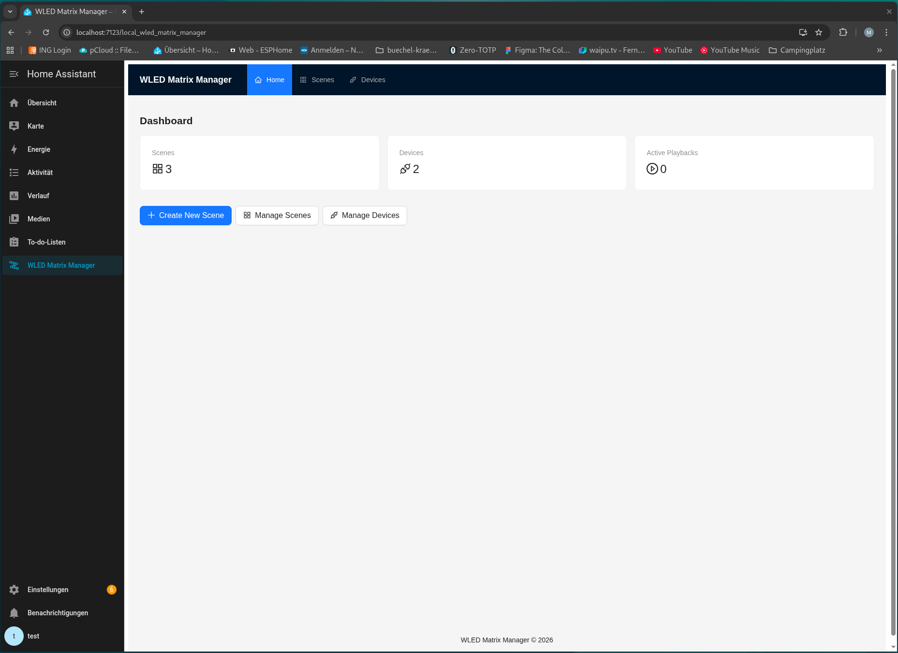
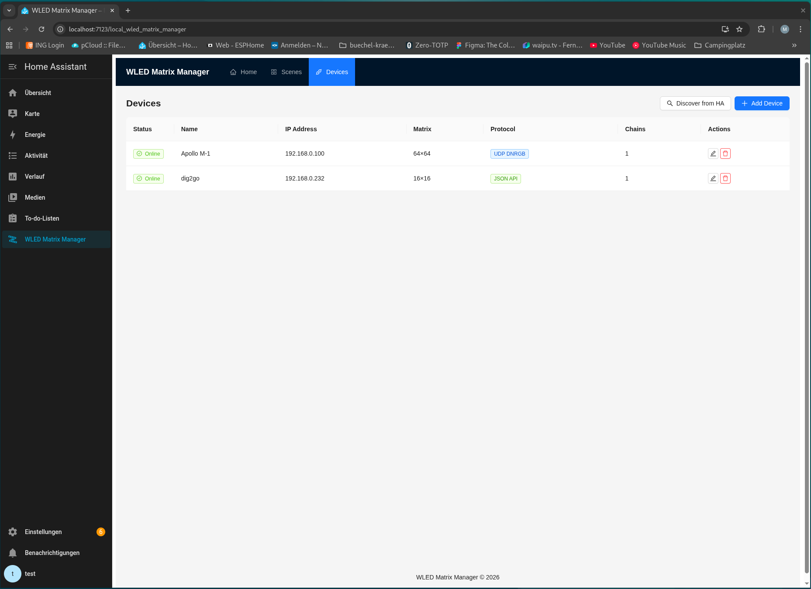
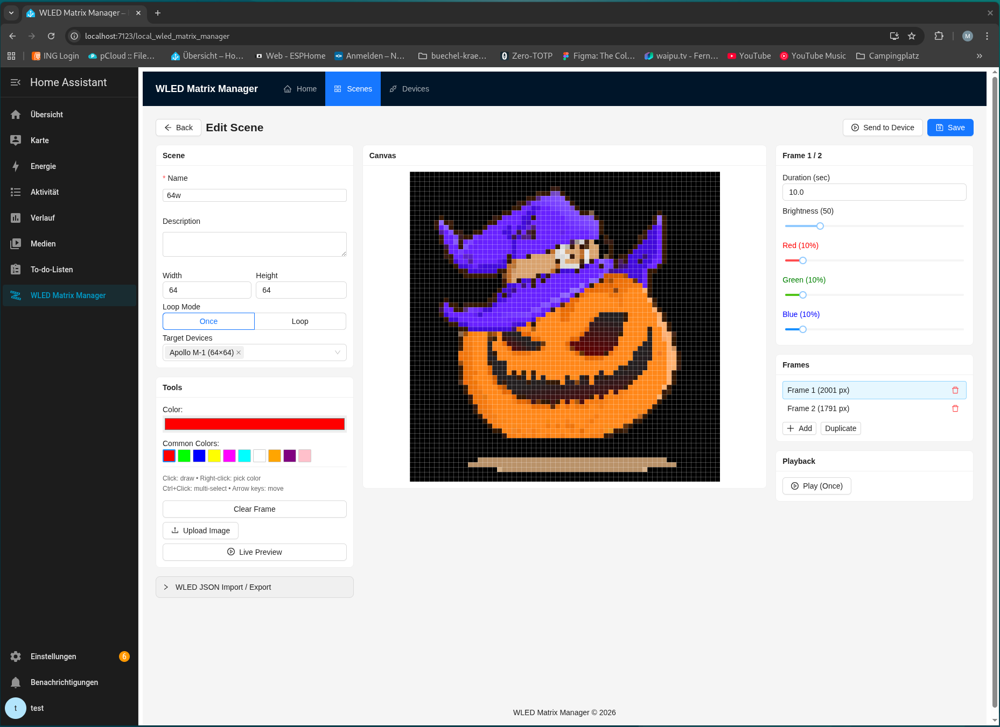

# WLED Matrix Manager — Home Assistant Add-on

Create and manage pixel-art scenes for WLED LED matrices directly from Home Assistant.

![Supports aarch64 Architecture][aarch64-shield]
![Supports amd64 Architecture][amd64-shield]

[](https://my.home-assistant.io/redirect/supervisor_add_addon_repository/?repository_url=https%3A%2F%2Fgithub.com%2Faiakos-k%2FWLED-Matrix-Manager)

## What is WLED Matrix Manager?

WLED Matrix Manager is a Home Assistant add-on that lets you:

- **Create pixel-art scenes** and play them on WLED LED matrices
- **Manage devices** — Add, configure, and check health status of WLED devices
- **Play animations** — Frame-based scenes with adjustable speed, brightness, and loop modes
- **Live preview** via WebSocket directly in the browser
- **Home Assistant integration** — Scenes are registered as HA entities and can be controlled via automations
- **Import/Export** — Import and export scenes as binary files or images

## Screenshots

### Dashboard



Overview showing scene count, connected devices, and active playbacks.

### Scene Management


Create, import, and play scenes directly on WLED matrices — with live preview.

### Device Management



Add WLED devices, check status, and choose communication protocol (JSON API or UDP DNRGB).

### Scene Editor



Pixel-art editor with frame support, color picker, brightness control, and live preview.

## Architecture

```
Home Assistant Core
    │ WebSocket API
    ▼
FastAPI Backend (:8000)
├── REST API (/api/...)      — Scenes, Devices, Playback
├── WebSocket (/ws)          — Live Preview & Status
├── WLED Communication       — JSON API + UDP DNRGB
└── SQLite Database          — Scene & Device Storage
    │
    ▼
React Frontend (Ingress UI)
├── Scene Editor             — Pixel-Art Editor with Frame Support
├── Device Management        — Manage WLED Devices
└── Playback Control         — Start/Stop Scenes
```

### Communication Protocols

| Protocol | Use Case | Max LEDs |
|----------|----------|----------|
| **JSON API** (`/json/state`) | Single frames, configuration | unlimited |
| **UDP DNRGB** (Port 21324) | Real-time streaming, animations | 489/packet (chunked) |

Details: [WLED_PROTOCOLS.md](./WLEDMatrixManager/backend/docs/WLED_PROTOCOLS.md)

## Installation

### Via Home Assistant Add-on Store

1. **Settings → Add-ons → Add-on Store** → ⋮ → **Repositories**
2. Add the repository URL
3. Install and start **WLED Matrix Manager**
4. The add-on appears in the **sidebar**

### Developer Setup

See [QUICKSTART.md](./QUICKSTART.md) for the DevContainer setup.

## Configuration

| Option | Description | Default |
|--------|-------------|---------|
| `log_level` | Log level (`debug`, `info`, `warning`, `error`) | `info` |

The add-on requires:
- **Homeassistant API** — for WebSocket communication with HA Core
- **Hassio API (admin)** — for Supervisor access
- **Network access** — UDP/HTTP communication with WLED devices

## API Overview

| Endpoint | Method | Description |
|----------|--------|-------------|
| `/api/status` | GET | Add-on status |
| `/api/devices` | GET/POST | List/create devices |
| `/api/devices/{id}` | PUT/DELETE | Edit/delete device |
| `/api/devices/{id}/health` | GET | WLED device health check |
| `/api/ha/discover` | GET | Discover WLED devices from HA |
| `/api/scenes` | GET/POST | List/create scenes |
| `/api/scenes/{id}` | GET/PUT/DELETE | Read/edit/delete scene |
| `/api/scenes/{id}/play` | POST | Play scene |
| `/api/scenes/{id}/stop` | POST | Stop playback |
| `/api/scenes/{id}/export` | GET | Export scene as binary file |
| `/api/scenes/import` | POST | Import scene |
| `/api/devices/test-frame` | POST | Send a single frame to devices |
| `/health` | GET | Health check |
| `/ws` | WebSocket | Live preview & playback status |

Swagger Docs: `http://<host>:8000/docs`

## Technologies

### Backend
- **Python 3.11+** / **FastAPI** / **Uvicorn**
- **SQLAlchemy** (async) + **SQLite**
- **aiohttp** — WLED HTTP & HA WebSocket
- **Pydantic** — Data validation
- **Pillow / NumPy** — Image processing

### Frontend
- **React 18** / **TypeScript** / **Vite**
- **Ant Design** — UI components
- **React Router** — SPA navigation

### Infrastructure
- **Docker** Multi-Stage Build
- **s6-overlay** — Process management
- **Home Assistant Ingress** — Seamless UI integration

## Documentation

- [QUICKSTART.md](./QUICKSTART.md) — DevContainer setup & first steps
- [TEMPLATE_GUIDE.md](./TEMPLATE_GUIDE.md) — Ingress routing & build architecture
- [WLED_PROTOCOLS.md](./WLEDMatrixManager/backend/docs/WLED_PROTOCOLS.md) — WLED protocol reference (JSON API, UDP DNRGB, Realtime Mode)
- [DOCS.md](./WLEDMatrixManager/DOCS.md) — Detailed add-on documentation

## License

This project is licensed under the **European Union Public Licence v. 1.2 (EUPL-1.2)**.

See [LICENSE](./LICENSE) for the full license text.

EUPL-1.2 is compatible with GPL v2/v3, AGPL v3, LGPL v2.1/v3, MPL v2, and others
(see the appendix of the license).

---

[aarch64-shield]: https://img.shields.io/badge/aarch64-yes-green.svg
[amd64-shield]: https://img.shields.io/badge/amd64-yes-green.svg
