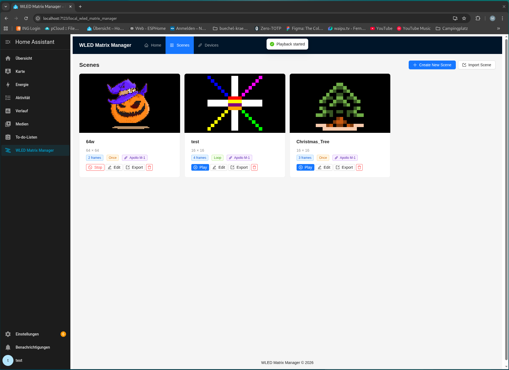

# Home Assistant Add-on: WLED Matrix Manager

Erstelle und verwalte Pixel-Art-Szenen für WLED LED-Matrizen.

![Supports aarch64 Architecture][aarch64-shield]
![Supports amd64 Architecture][amd64-shield]

## Über dieses Add-on

WLED Matrix Manager ermöglicht es dir, Pixel-Art-Szenen für WLED-gesteuerte LED-Matrizen
direkt aus Home Assistant heraus zu erstellen, zu verwalten und abzuspielen.

### Features

- **Scene Editor** — Pixel-Art-Szenen mit mehreren Frames erstellen
- **Device Management** — WLED-Geräte hinzufügen und konfigurieren
- **Playback** — Animationen auf WLED-Matrizen abspielen (JSON API oder UDP DNRGB)
- **HA Integration** — Szenen als Home Assistant Entities, per Automatisierung steuerbar
- **Auto-Discovery** — WLED-Geräte automatisch aus Home Assistant erkennen
- **Import/Export** — Szenen als Binärdatei oder Bild importieren/exportieren
- **Live-Vorschau** — WebSocket-basierte Echtzeit-Vorschau im Browser

### Unterstützte WLED-Protokolle

| Protokoll | Beschreibung |
|-----------|-------------|
| JSON API | HTTP-basiert, für Einzelframes und Konfiguration |
| UDP DNRGB | Echtzeit-Streaming, ideal für Animationen (bis 489 LEDs/Paket) |

## Lizenz

EUPL-1.2 — Siehe [LICENSE](https://eupl.eu/1.2/de/)

[aarch64-shield]: https://img.shields.io/badge/aarch64-yes-green.svg
[amd64-shield]: https://img.shields.io/badge/amd64-yes-green.svg
